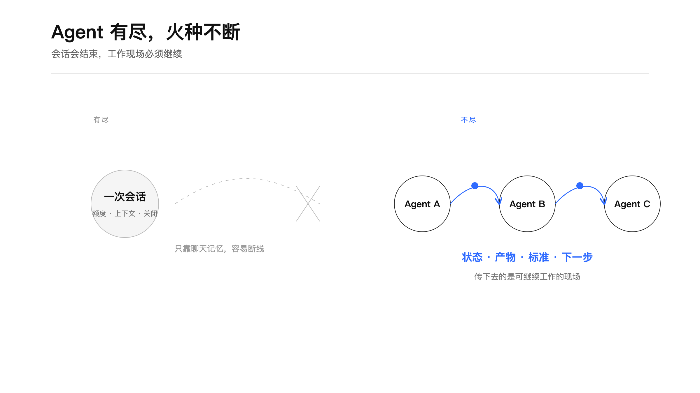
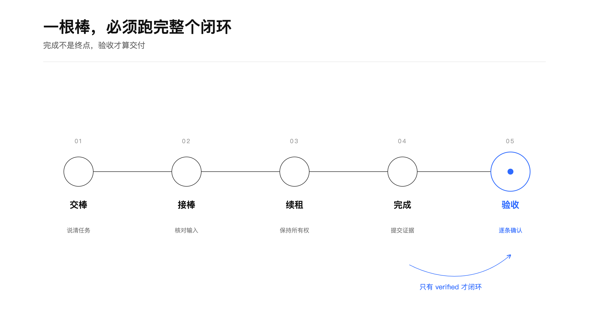
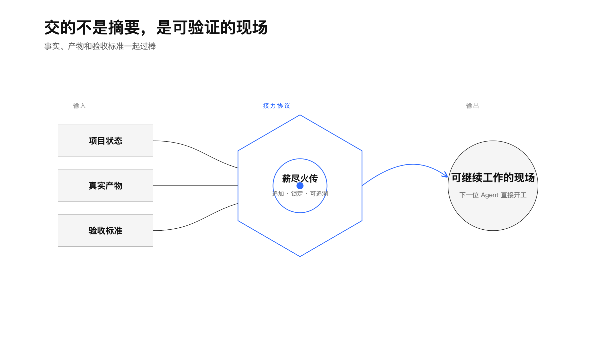
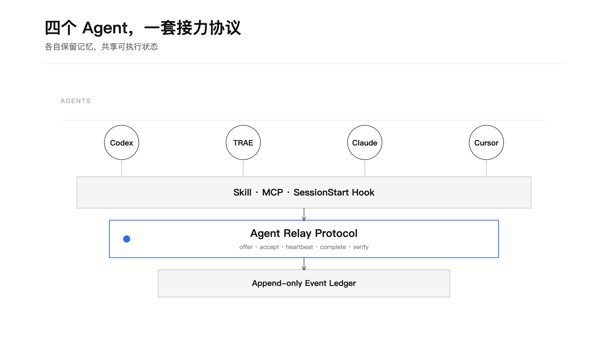
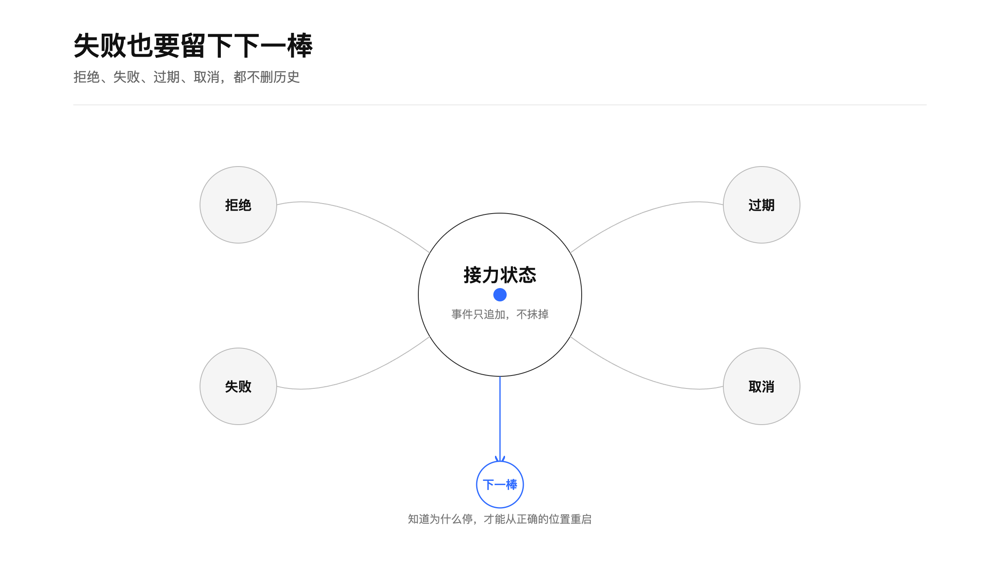

<div align="center">

### **“指穷于为薪，火传也，不知其尽也。”**

— 《庄子·养生主》

<br>

*薪会燃尽，火却可以传下去。*  
*Agent 会结束，工作不必从头开始。*

</div>

---

# 薪尽火传 · Agent Relay

**让不同 AI Agent 带着可验证的工作现场可靠接棒。**

Codex 做到一半，换 TRAE；TRAE 遇到限额，交给 Claude；Claude 完成后，让另一个 Agent 验收。传递的不只是聊天摘要，而是**当前状态、真实产物、关键决定、阻塞、下一步和验收标准**。

支持 Codex、TRAE CLI、Claude Code、Cursor，以及任何能使用 Agent Skills、CLI 或 MCP 的工具。

> **Pass the work, not just the context.**

---

## 为什么需要它

AI Agent 很强，但每一段会话都有边界：额度会用完，上下文会压缩，客户端会切换，任务可能跨过几天、几个月，甚至跨过不同模型。

传统“共享记忆”只能让下一个 Agent **知道发生过什么**。真正的接力还需要让它知道：

- 现在做到哪；
- 该相信哪些事实；
- 产物在哪里，是否被改过；
- 谁拥有这一棒；
- 什么条件才算完成；
- 失败后从哪里重启。



**薪尽火传**把 Agent 的长期记忆和项目的可执行状态分开：

- 每个 Agent 保留自己的原生 memory；
- 所有 Agent 共享一份追加式 Relay 账本；
- 接棒前验证输入，完成时提交证据，交棒方最终验收。

---

## 接力不是一条 handoff 消息

一根棒必须跑完整个闭环：



```text
offer → accept → heartbeat → complete → verify
```

| 状态 | 含义 |
| --- | --- |
| `offered` | 交棒已创建，等待目标 Agent 接收 |
| `accepted` | 接棒方核对输入产物，取得工作租约 |
| `heartbeat` | 长任务续租，表明这一棒仍在执行 |
| `completed` | 接棒方声明完成并提交证据 |
| `verified` | 验收方确认产物和标准，接力闭环 |

`completed` 还不是结束。只有 `verified` 才是成功终态。

同时支持 `rejected / failed / cancelled / expired`。所有状态只追加、不抹掉，失败也会成为下一棒的起点。

---

## 交的是可验证现场



### 交棒时

- 写明目标 Agent 和验收方；
- 至少提供一条验收标准；
- 记录项目状态、下一步和阻塞；
- 对本地文件生成 SHA-256；
- 对目录生成内容树摘要；
- 记录 Git HEAD、分支和脏状态。

### 接棒时

薪尽火传重新计算输入产物指纹。产物缺失或发生变化时，默认拒绝接棒，避免新 Agent 在错误现场继续工作。

### 完成与验收

接棒方必须提交产物或可复核来源；验收方逐条确认标准，并重新检查完成产物。

---

## 四个 Agent，一套协议



薪尽火传提供三种入口：

1. **Skill**：告诉 Agent 什么时候接棒、交棒、完成和验收；
2. **MCP**：向不同客户端暴露同一套结构化工具；
3. **SessionStart Hook**：会话开始时只读注入当前项目和待接棒队列。

底层采用追加式 JSONL 事件账本，SQLite 只做可重建索引。Agent 原生 memory 相互独立，避免平台各自的 consolidation 任务互相覆盖。

### MCP 工具

```text
relay_bootstrap   relay_context   relay_inbox      relay_show
relay_search      relay_offer     relay_accept     relay_heartbeat
relay_complete    relay_verify    relay_reject     relay_fail
relay_cancel      relay_expire    relay_capture    relay_doctor
```

---

## 失败也要留下下一棒



拒绝、失败、过期和取消都不会删除历史。

下一位 Agent 能看到：

- 为什么停；
- 停在哪；
- 哪些方案已经试过；
- 哪些产物仍可信；
- 下一次从哪里开始最合理。

这让失败从“上下文丢失”变成“有依据的重新分配”。

---

## 安装

### 1. Clone

```bash
git clone https://github.com/TongyiDai/xinjin-huochuan.git
cd xinjin-huochuan
```

要求 Python 3.10+。核心 CLI、MCP Server 和 Hook 均只使用 Python 标准库。

### 2. 最小安装

安装 Skill 与 CLI，保留旧版 `agent-memory-hub / memory-hub` 兼容入口：

```bash
python3 scripts/install.py \
  --agents codex,trae,claude,cursor
```

### 3. 完整安装

同时注册 MCP 与 SessionStart Hook：

```bash
python3 scripts/install.py \
  --agents codex,trae,claude,cursor \
  --with-mcp \
  --with-hooks
```

安装器会：

- 创建或迁移 `~/.agent-relay`；
- 注册各 Agent；
- 安装 `agent-relay` Skill；
- 安装 `agent-relay` CLI；
- 可选写入 MCP 和 SessionStart Hook；
- 修改配置前自动生成备份；
- 可重复执行，不重复安装。

> Hook 只读取上下文，不会自动接棒、完成或验收。任何会改变 Relay 状态的动作仍由 Agent 明确调用。

### 4. 初始化项目

```bash
agent-relay bootstrap \
  --project "$PWD" \
  --name "My Project" \
  --goal "Ship the first reliable version" \
  --agent codex
```

纯 MCP 客户端可以调用 `relay_bootstrap`。

---

## 快速开始

### TRAE 把工作交给 Codex

```bash
agent-relay offer \
  --project "$PWD" \
  --from-agent trae \
  --to-agent codex \
  --summary "实现完成，交给 Codex 做边界验证" \
  --acceptance "测试全部通过" \
  --acceptance "不存在敏感信息" \
  --artifact "./src" \
  --source-ref "test: integration suite passed" \
  --priority high
```

返回一个 `relay-xxxxxxxxxxxx`。

### Codex 查看并接棒

```bash
agent-relay context --project "$PWD" --agent codex
agent-relay inbox --project "$PWD" --agent codex

agent-relay accept \
  --relay relay-xxxxxxxxxxxx \
  --agent codex \
  --summary "已核对输入产物，开始接棒"
```

### 长任务续租

```bash
agent-relay heartbeat \
  --relay relay-xxxxxxxxxxxx \
  --agent codex \
  --summary "边界测试进行中"
```

### Codex 完成并提交证据

```bash
agent-relay complete \
  --relay relay-xxxxxxxxxxxx \
  --agent codex \
  --summary "边界验证完成" \
  --artifact "./artifacts/test-results.json"
```

### TRAE 验收闭环

```bash
agent-relay verify \
  --relay relay-xxxxxxxxxxxx \
  --agent trae \
  --summary "产物与验收标准均已确认" \
  --accept-all-criteria
```

---

## 进阶能力

### 第三方验收

交棒时指定另一个 Agent 作为验收者：

```bash
agent-relay offer \
  --project "$PWD" \
  --from-agent trae \
  --to-agent codex \
  --verifier claude \
  --summary "实现完成，独立验收" \
  --acceptance "输出符合协议"
```

### 依赖链

```bash
agent-relay offer \
  --project "$PWD" \
  --from-agent codex \
  --to-agent claude \
  --depends-on relay-parent-id \
  --parent-relay relay-parent-id \
  --summary "在上游验收后继续" \
  --acceptance "下游验证通过"
```

依赖 Relay 未达到 `verified` 时，下游无法接棒。

### 幂等重试

```bash
agent-relay accept \
  --relay relay-xxxxxxxxxxxx \
  --agent codex \
  --summary "开始接棒" \
  --idempotency-key accept-build-42
```

相同键重复提交会返回同一事件，不会产生重复状态。

### 健康检查与恢复

```bash
agent-relay doctor
agent-relay rebuild
agent-relay backup
agent-relay --hub /path/to/new-hub restore backup.tar.gz
```

---

## 数据结构

```text
~/.agent-relay/
├── manifest.json
├── index.sqlite                  # 可重建索引
├── agents/
├── projects/
│   └── <project-id>/
│       ├── profile.json
│       ├── CURRENT.md            # 当前状态视图
│       └── events/
│           └── YYYY-MM.jsonl     # 事实源
├── sources/
├── backups/
└── locks/
```

事件日志是事实源；`CURRENT.md` 和 SQLite 均可从事件重建。

---

## 安全边界

- 不保存密码、API Key、访问令牌和私钥；
- 内置常见 Token 模式检查；
- 不保存原始聊天全文；
- 不把猜测写成事实；
- 不允许缺少证据的 `complete`；
- 状态转换在文件锁内二次检查，避免双接棒；
- 恢复备份时防止压缩包路径穿越；
- 本地文件后端面向单机或可信同步盘。

跨机器或团队使用时，还应增加认证、授权、加密和真正的事务后端。

---

## 与现有方案的关系

这个项目不是通用知识库，也不是 Agent 聊天室。

| 类别 | 代表方向 | 主要解决 |
| --- | --- | --- |
| 长期记忆 | Mem0、Basic Memory、Obsidian Mind | Agent 记得什么 |
| 多 Agent 通讯 | MCP Agent Mail、Basemind comms | Agent 如何同时协作 |
| **薪尽火传** | Agent Relay Protocol | Agent 如何带着可验证现场接棒 |

我们借鉴了社区中共享记忆、MCP 协作和文件租约的实践，但把产品边界收敛在“工作所有权如何可靠转移”。

---

## 测试与验证

当前测试覆盖：

- 完整 Relay 生命周期；
- 角色权限与非法状态转换；
- 双 Agent 并发抢棒；
- 幂等重试；
- 输入与完成产物篡改；
- 敏感信息拦截；
- 依赖链与父子 Relay；
- offer/lease 过期；
- 第三方验收；
- 备份与安全恢复；
- 只读 SessionStart Hook；
- MCP 初始化与工具调用；
- 安装、迁移和卸载。

```bash
python3 -m unittest -v \
  scripts/test_agent_relay.py \
  scripts/test_agent_relay_v2.py
```

---

## 目录结构

```text
xinjin-huochuan/
├── README.md
├── SKILL.md
├── agents/openai.yaml
├── references/protocol.md
├── scripts/
│   ├── agent_relay.py
│   ├── agent_relay_mcp.py
│   ├── session_start.py
│   ├── install.py
│   ├── build_boards.py
│   └── test_*.py
└── assets/boards/
    ├── *.scene.json
    ├── *.svg
    └── *.png
```

---

## 致谢

- 名称取意自《庄子·养生主》：“指穷于为薪，火传也，不知其尽也。”
- 说明画板使用 [TongyiDai/geometry-board-skill](https://github.com/TongyiDai/geometry-board-skill) 的视觉语言构建。
- 开工前 prior-art 调研由 [TongyiDai/giants-shoulders](https://github.com/TongyiDai/giants-shoulders) 提供方法论。

## License

MIT
