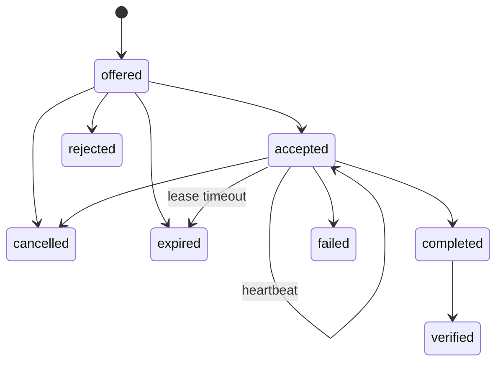

# Agent Relay Protocol v2

## 目录

1. 产品边界
2. 两层记忆
3. Relay 状态机
4. 角色与权限
5. 产物与验收
6. 租约、过期与依赖
7. 事件模型
8. 并发、幂等与恢复
9. 自动化边界
10. 隐私与安全

## 1. 产品边界

Agent Relay 解决不同 AI Agent 之间的工作接力：

```text
Capture → Offer → Accept → Heartbeat → Complete → Verify
```

共享记忆只是存储能力。Relay 额外约束：

- 谁交棒、谁接棒、谁验收；
- 接棒前必须验证输入产物；
- 完成时必须提供证据；
- 验收标准必须逐条确认；
- 每个阶段均可审计和恢复。

Relay 不负责自动执行任务、代码合并、多人文件锁和业务审批。

## 2. 两层记忆

| 层 | 内容 | 写入者 | 特征 |
| --- | --- | --- | --- |
| Agent 原生 memory | 用户偏好、工具经验、平台规则 | 各 Agent 平台 | 私有格式，可被平台重建 |
| Relay Hub | 项目事实、接力状态、决定、产物、证据、验收 | 所有 Agent | 中立、追加式、可追溯 |

不同平台不要共写同一份私有 `MEMORY.md`。它们通过 Relay Hub 共享可执行项目状态。

## 3. Relay 状态机



- `offered`：交棒已创建，尚未接收。
- `accepted`：目标 Agent 已核对输入并取得租约。
- `completed`：接棒方声明完成并提交证据，仍待验收。
- `verified`：验收方确认标准与产物，接力闭环。
- `rejected`：目标 Agent 拒绝接棒。
- `failed`：接棒方执行失败。
- `cancelled`：交棒方或当前接棒方取消。
- `expired`：接收期限或执行租约超时。

`completed` 不能视为完成；只有 `verified` 是成功终态。

## 4. 角色与权限

| 动作 | 允许角色 |
| --- | --- |
| offer | 任意已注册 Agent |
| accept / reject | `to_agent` |
| heartbeat / complete / fail | `accepted_by` |
| verify | `verifier_agent`，默认交棒方 |
| cancel | 交棒方或当前接棒方 |

交棒方和接棒方不能相同。验收方可以是第三个 Agent。

## 5. 产物与验收

### 输入产物

`offer` 会为本地文件或目录记录：

- 规范化路径；
- 文件大小和 SHA-256；
- 目录文件数、总大小和树摘要；
- Git 根、HEAD、分支和路径脏状态。

`accept` 重新计算指纹。输入缺失或改变时默认拒绝接棒，只有人工核查后才能使用覆盖参数。

### 完成证据

`complete` 至少包含：

- 一个产物路径；或
- 一个可复核来源，例如测试运行、云端文档或任务链接。

### 验收标准

`offer` 至少包含一条 `acceptance_criteria`。`verify` 必须逐条确认或显式确认全部标准，再重新核验完成产物。

## 6. 租约、过期与依赖

- 未接收 Relay 默认 7 天过期。
- 接棒后默认租约 1 小时。
- 长任务通过 `heartbeat` 续租。
- `expire` 把超时 Relay 追加为 `expired`，不删除历史。
- Relay 可通过 `depends_on` 声明依赖；依赖未达到 `verified` 时不能接棒。
- `parent_relay_id` 表示一条 Relay 从另一条 Relay 拆出。

租约属于工作所有权信号，不是操作系统锁。

## 7. 事件模型

```json
{
  "schema_version": 2,
  "event_id": "uuid",
  "timestamp": "UTC ISO-8601",
  "project_id": "name-pathhash",
  "agent_id": "codex",
  "event_type": "relay.created",
  "status": "in_progress",
  "summary": "交给 Codex 做边界验证",
  "payload": {
    "relay_id": "relay-xxxxxxxxxxxx",
    "to_agent": "codex",
    "verifier_agent": "trae",
    "priority": "high",
    "expires_at": "ISO-8601",
    "lease_seconds": 3600,
    "acceptance_criteria": ["测试通过"],
    "depends_on": [],
    "artifacts": [],
    "artifact_snapshots": [],
    "source_refs": [],
    "idempotency_key": "optional"
  }
}
```

`events/*.jsonl` 是事实源。`CURRENT.md` 与 `index.sqlite` 都是可重建视图。

## 8. 并发、幂等与恢复

- 写入使用进程级文件锁与追加式 JSONL。
- 状态转换在锁内重新读取当前状态，防止双接棒。
- `idempotency_key` 支持安全重试；同一键不能用于不同操作。
- profile 与 CURRENT 使用原子替换。
- SQLite 只做可重建索引；只读查询直接读取事件日志。
- `doctor` 检查非法状态历史、悬空事件、重复 ID、索引漂移、缺失证据、过期 Relay 与敏感信息。
- `backup` 不打包派生索引；`restore` 校验路径，防止压缩包路径穿越。
- `rebuild` 从事件日志恢复索引和当前视图。

## 9. 自动化边界

- SessionStart Hook 只读注入有字符预算的 Context Pack。
- Hook 不自动 accept、complete 或 verify。
- MCP 暴露读取与写入工具，工具声明只读、破坏性和幂等提示。
- Stop Hook 不应自动从聊天猜测事实并写入；Agent 应在有明确证据时主动调用 `capture` 或 `offer`。

## 10. 隐私与安全

禁止写入：

- 密码、API Key、访问令牌、私钥；
- 原始聊天全文；
- 未筛选的个人信息和高敏业务数据；
- 缺少证据的“已完成”。

记录安全引用，例如：

- `credential: macOS Keychain item "lark-personal"`
- `artifact: /safe/path/report.md`
- `source_ref: test: integration suite passed`

共享到团队仓库或跨机器存储前，需要增加认证、访问控制、加密和数据分级。当前文件后端主要面向单机或可信同步盘。
